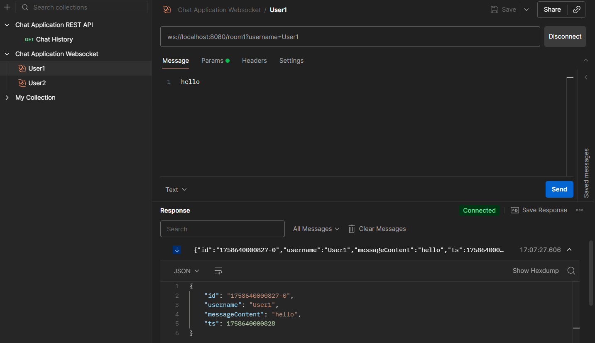
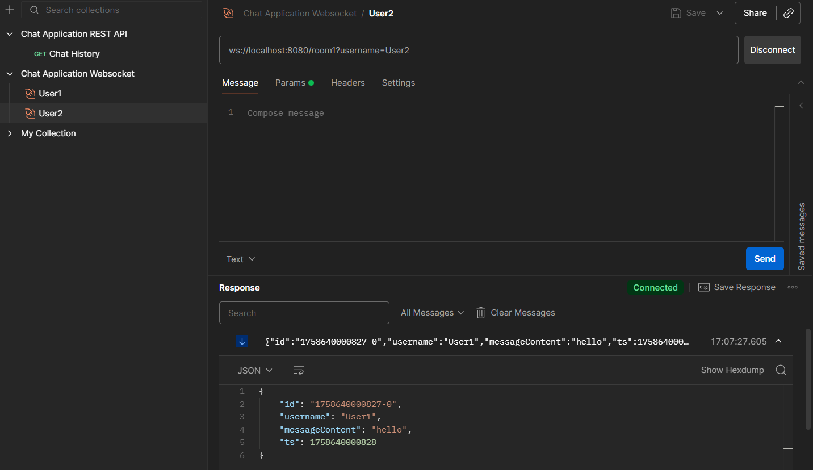
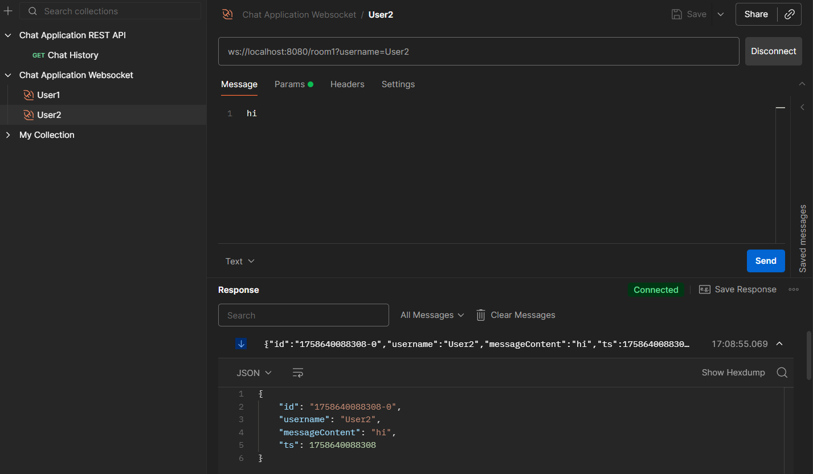
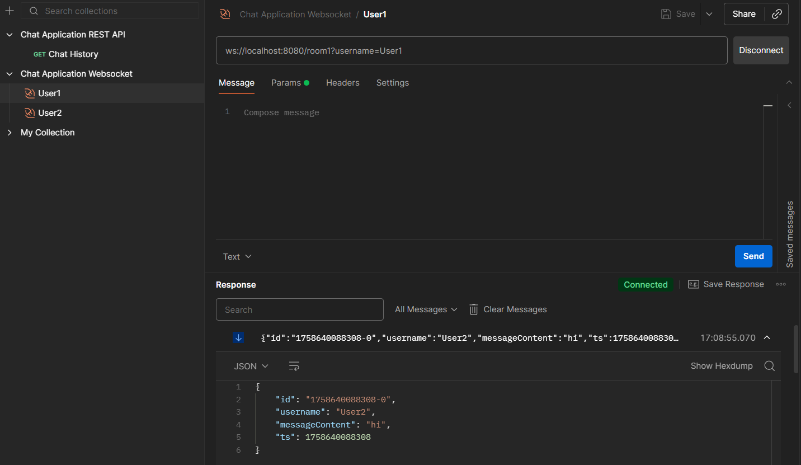
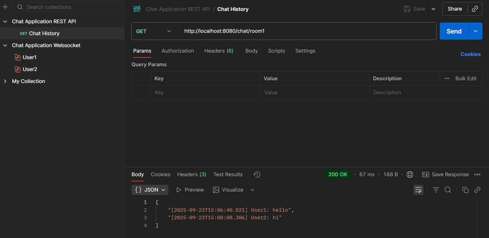

# Chat Application Backend
### Chat application created using Java, Micronaut, Redis, WebSockets and REST API

### Project goal
The purpose of this project is to build a real-time chat application backend that allows users to communicate within multiple chat rooms. 
The application leverages `WebSockets` for live communication and `Redis Streams` for message persistence.
Additionally, a `REST API` endpoint is provided to fetch chat history from specific rooms.
<br>
This project only covers the backend and is intended to run locally. 
No external deployment is required.

### Features
**1. WebSocket Endpoint**
* Address: `ws://localhost:8080/{room_id}`
  * `{room_id}`- identifier of the chat rrom a user wants to join
* Parameters:
  * `username`- the username of the participant, passed as a query parameter

**2. Real-Time Communication**
* Users connected to the same room can send and receive messages in real time
* Messages sent by one user are broadcast to all participants in the same room

**3. Message Persistence with Redis Streams**
* Each chat room has its own `Redis Stream` where messages are stored
* This enables fetching past conversations even after users disconnect

**4. REST API Endpoint for Chat History**
* Address: `GET http://localhost:8080/chat/{room_id}`
  * `{room_id}`- the identifier of the chat room
* Functionality: Returns all stored messages from the `Redis Stream` for the given room

**5. Dockerized Environment**
* Both `Micronaut Application` and `Redis` run in `Docker` containers for easy setup and management
* Includes:
  * `Dockerfile` for building the Micronaut container
  * `docker-compose.yml` for running Micronaut and Redis together


### Getting started

#### Prerequisites
* `Docker` installed
* `Docker Compose` installed
* `wscat` installed for usage in terminal

#### Run the application
1. Clone this repository
    ```bash
    git clone https://github.com/Tomaszek03/Chat-Application.git
    ```

2. Build a project with fat-jar
    ```bash
    ./gradlew shadowJar
    ```
3. Start the services
    ```bash
    docker-compose up --build
    ```

4. The services will be available at:
* WebSocket endpoint: `ws://localhost:8080/{room_id}?username=yourName`
* REST endpoint (chat history): `http://localhost:8080/chat/{room_id}`

### Example usage (terminal)

**Terminal 1.**
1. Connect to room as `User1`:
    ```bash
    wscat -c "ws://localhost:8080/room1?username=User1"
    ```
2. Send message (for example type `hello` and press `ENTER`)

<br>

**Terminal 2.**
1. Connect to room as `User2`:
    ```bash
    wscat -c "ws://localhost:8080/room1?username=User2"
    ```
2. Send message (for example type `hi` and press `ENTER`)

<br>

**Terminal 3.**
<br>Get messages history from `room1`:
```bash
curl http://localhost:8080/chat/room1
```
The history is visible in the `Content` field in format:
`[{time}] {user}: {message}`

### Example usage (Postman)

1. `User1` sends message in `room1`
    

2. `User2` receives `User1`'s message in `room1`
   

3. `User2` sends message in `room1`
   

4. `User1` receives `User2`'s message in `room1`
   

5. Chat history from `room1`
   
